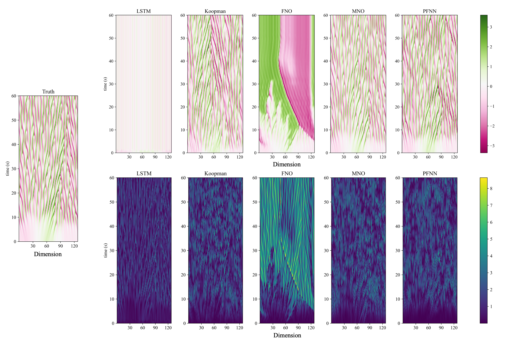
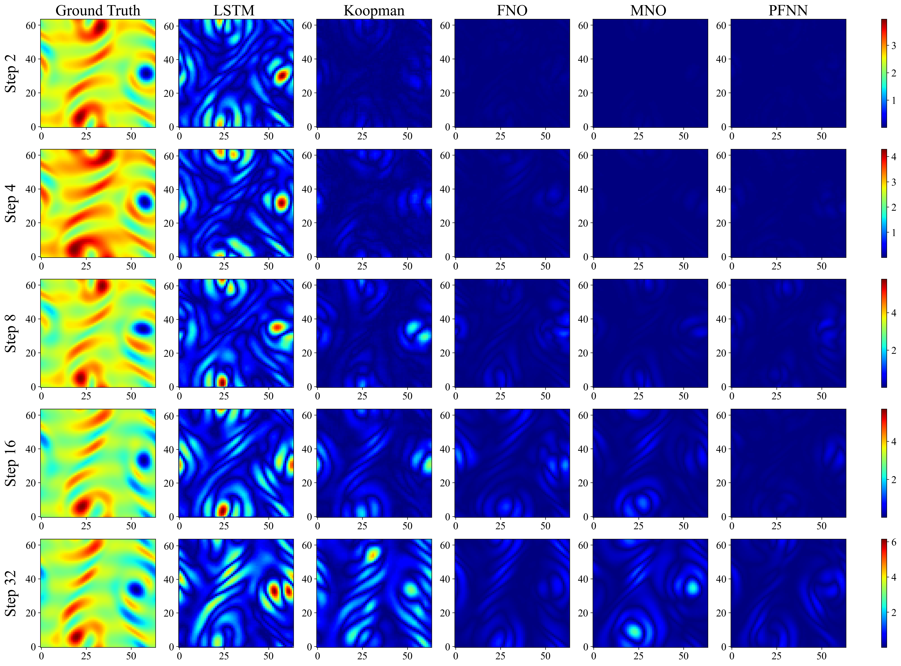

# Poincaré Flow Neural Network: Learning Chaos In A Linear Way

This is the implementation of the paper Poincaré Flow Neural Network: Learning Chaos In A Linear Way.

Learning long-term behaviors in chaotic dynamical systems, such as turbulent flows and climate modelling, is challenging due to their inherent instability and unpredictability. These systems go beyond initial value problems, making precise long-term forecasting theoretically impossible. As a result, understanding long-term statistical behavior is far more valuable than focusing on short-term accuracy. While autoregressive deep sequence models have been applied to capture long-term behavior, they often lead to exponentially increasing errors in learned dynamics. To address this, we shift the focus from the simple prediction errors to preserving an invariant measure in dissipative chaotic systems. These systems have attractors, where trajectories settle, and the invariant measure is the probability distribution on attractors that remains unchanged under dynamics. We propose the Poincaré Flow Neural Network (PFNN), a novel operator learning framework designed to capture behaviors of chaotic systems without any explicit knowledge on the invariant measure.
PFNN employs  an auto-encoder to map the chaotic system to a finite dimensional feature space, effectively linearizing the chaotic evolution.
It then learns the linear evolution operators to match the physical dynamics by addressing two critical properties in dissipative chaotic systems: (1) contraction, the system’s convergence toward its attractors, and (2) measure invariance, trajectories on the attractors following a probability distribution invariant to the dynamics.
Our experiments on a variety of chaotic systems including Lorenz 96, Kuramoto-Sivashinsky equation and Navier–Stokes equation demonstrate that PFNN has more accurate predictions and physical statistics compared to competitive baselines including the Fourier Neural Operator and the Markov Neural Operator.

## Dispative Chaotic system demo

### Lorenz 96 (1D, Dimension 80)


### KS (1D, Dimension128)



### Kolmogorov Flow (2D, Dimension 64 $\times$ 64)



## Install and dependence

In the beginning, simply try to clone the repository via

> ```
> git clone https://github.com/Hy23333/PFNN.git
> ```

Then, create the enviroment for PFNN via

```
conda env create -f environment.yml
conda activate PFNN
```
